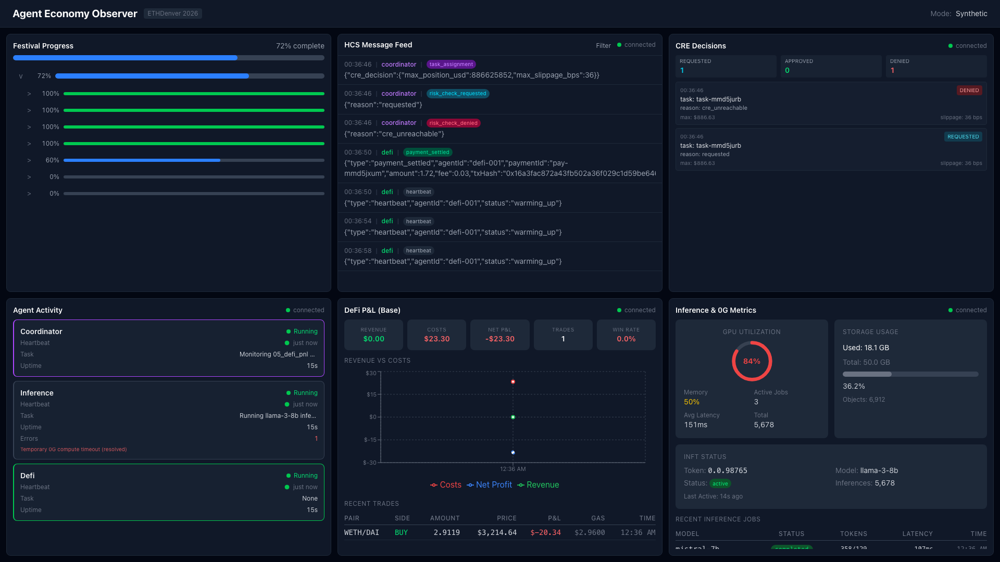

# dashboard

[](https://nextjs.org)
[](https://react.dev)
[](https://www.typescriptlang.org)
[](https://tailwindcss.com)

Real-time observer dashboard for the agent economy.

Part of the [ETHDenver 2026 Agent Economy](../README.md) submission.

## Overview

Read-only Next.js dashboard that visualizes the multi-agent economy in real time. Displays festival progress, HCS message feeds, agent activity, DeFi P&L metrics, and 0G inference stats across five panels. Supports multiple data sources: mock data for demos, WebSocket for live events, gRPC for direct daemon connection, and Hedera Mirror Node for HCS messages.

> **TL;DR** — Read-only Next.js dashboard that visualizes the multi-agent economy in real time: festival progress, HCS message feeds, CRE risk decisions, agent activity, DeFi P&L, and 0G inference metrics. Supports mock, WebSocket, gRPC, and Mirror Node data sources.

## Built with Obedience Corp

This project is part of an [Obedience Corp](https://obediencecorp.com) campaign — built and planned using **camp** (campaign management) and **fest** (festival methodology). This repository, its git history, and the planning artifacts in `festivals/` are a live example of these tools in action.

The Festival View panel visualizes festival methodology progress. Agent events flow through the **obey daemon's** event pipeline via WebSocket or gRPC.

## Screenshot



## Panels

| Panel | Description |
|-------|-------------|
| Festival View | Festival methodology progress (phases, sequences, tasks) |
| HCS Feed | Live Hedera Consensus Service message stream |
| CRE Decisions | CRE risk lifecycle (`risk_check_requested/approved/denied`) with decision reasons |
| Agent Activity | Agent status, heartbeats, uptime |
| DeFi P&L | Trading performance, profit/loss charts |
| Inference Metrics | 0G compute job stats, storage, iNFT status |

## Quick Start

```bash
cp .env.example .env
just install
just dev
```

Open [http://localhost:3000](http://localhost:3000). Set `NEXT_PUBLIC_USE_MOCK=true` for demo mode without live agents.

## Prerequisites

- Node.js >= 18
- npm

## Configuration

| Variable | Description |
|----------|-------------|
| `NEXT_PUBLIC_USE_MOCK` | Enable mock data mode (default: false) |
| `NEXT_PUBLIC_HUB_WS_URL` | Hub WebSocket endpoint for live events |
| `NEXT_PUBLIC_USE_GRPC` | Use gRPC instead of WebSocket (default: false) |
| `NEXT_PUBLIC_DAEMON_GRPC_URL` | Daemon gRPC address (dev only) |
| `NEXT_PUBLIC_HEDERA_MIRROR_NODE_URL` | Hedera Mirror Node REST API |
| `NEXT_PUBLIC_HEDERA_TOPIC_IDS` | Comma-separated HCS topic IDs to observe |

## Data Sources

- **Mock** -- Generates synthetic data for demos. Set `NEXT_PUBLIC_USE_MOCK=true`.
- **WebSocket** -- Connects to hub for real-time daemon events. Default production mode.
- **gRPC** -- Direct daemon connection for local development.
- **Mirror Node** -- Polls Hedera Mirror Node REST API for HCS messages and festival progress.

## Project Structure

```
dashboard/
├── src/
│   ├── app/                   # Next.js app router (layout, page)
│   ├── components/
│   │   ├── panels/            # 6 dashboard panels
│   │   ├── ui/                # Shared components (ProgressBar, StatusBadge)
│   │   └── DashboardLayout.tsx # Grid layout shell
│   ├── hooks/                 # Data hooks (useWebSocket, useMirrorNode, useMockData, useGRPC)
│   └── lib/
│       ├── data/              # Client libraries (WebSocket, gRPC, Mirror Node, Mock)
│       └── utils/             # Formatting utilities
├── public/                    # Static assets
├── justfile                   # Task runner recipes
└── package.json
```

## Development

```bash
just install    # Install dependencies
just dev        # Development server (localhost:3000)
just build      # Production build
just lint       # ESLint via next lint
just clean      # Remove build artifacts
```

## License

MIT
